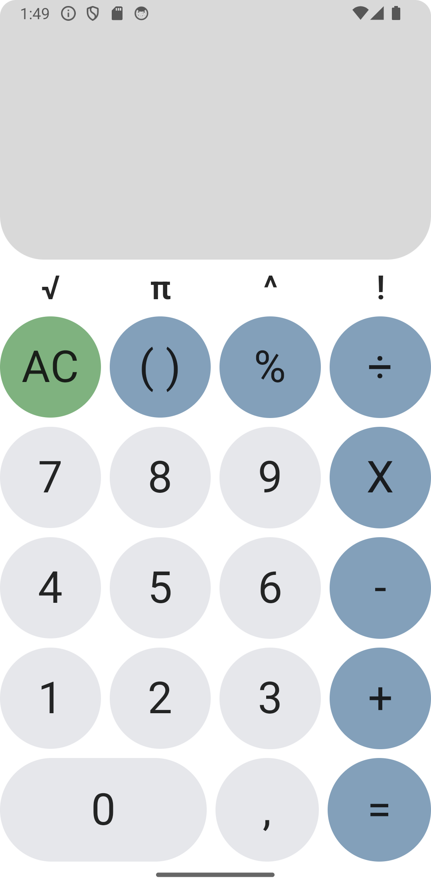
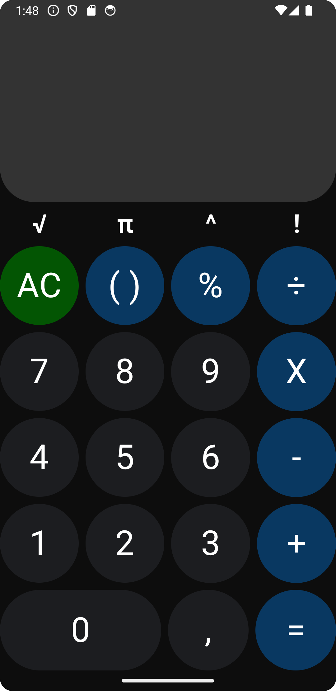
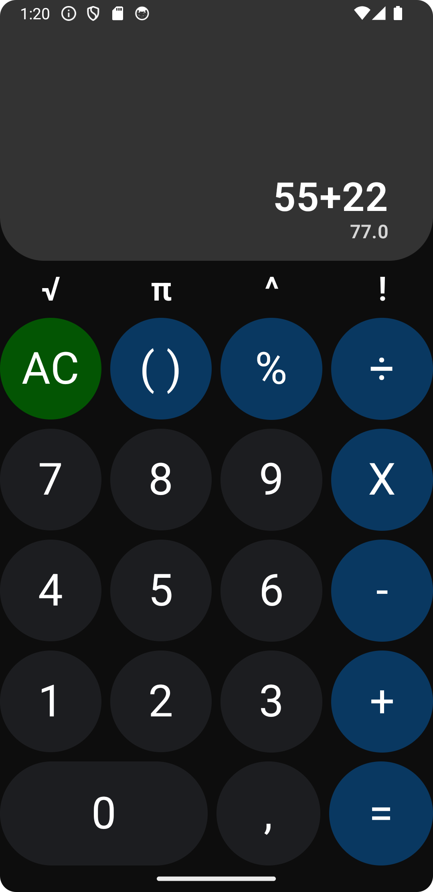

Calculator App

Android-приложение — калькулятор, написанное на Kotlin с использованием Jetpack Compose и упрощенной MVVM (ViewModel + StateFlow).
Поддерживает стандартные арифметические операции, скобки, проценты, степень, факториал и число π.

Скриншоты

  
  
  

Функционал

- Базовые арифметические операции (+, -, ×, ÷)
- Дополнительные операции: %, √, ^, !, π
- Автоматическая расстановка скобок
- Динамический пересчёт выражения при вводе
- Тёмная тема

Технологии

- Kotlin
- Jetpack Compose
- ViewModel + StateFlow
- Material3
- mXparser

Запуск

1. Клонировать репозиторий: git clone https://github.com/galaxykud/calculator-app.git
2. Открыть в Android Studio
3. Запустить на эмуляторе или устройстве

Возможные улучшения

1. Добавить историю вычислений
2. Реализовать поддержку сложных выражений
3. Добавить модульные тесты (JUnit, Espresso)

